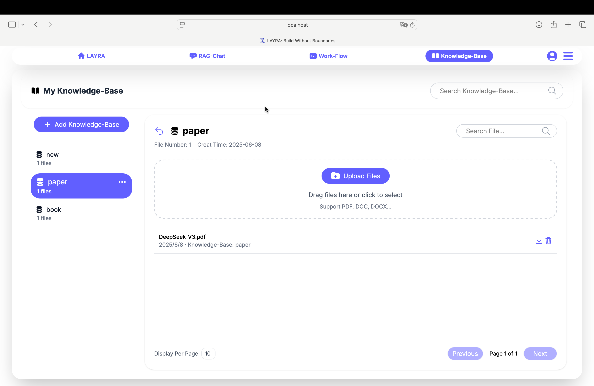
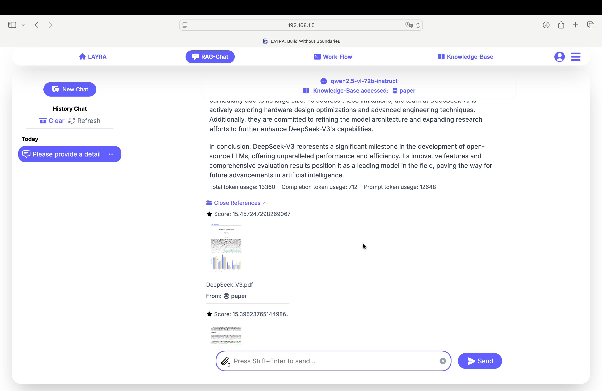
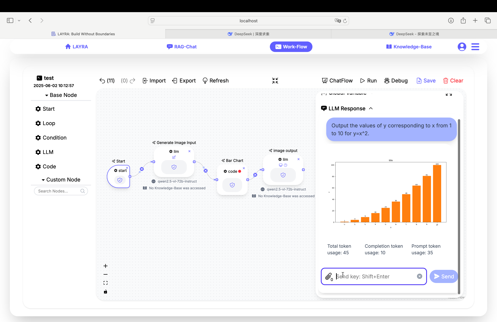
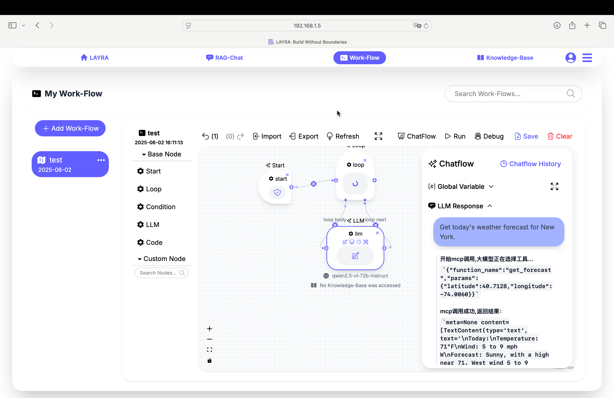
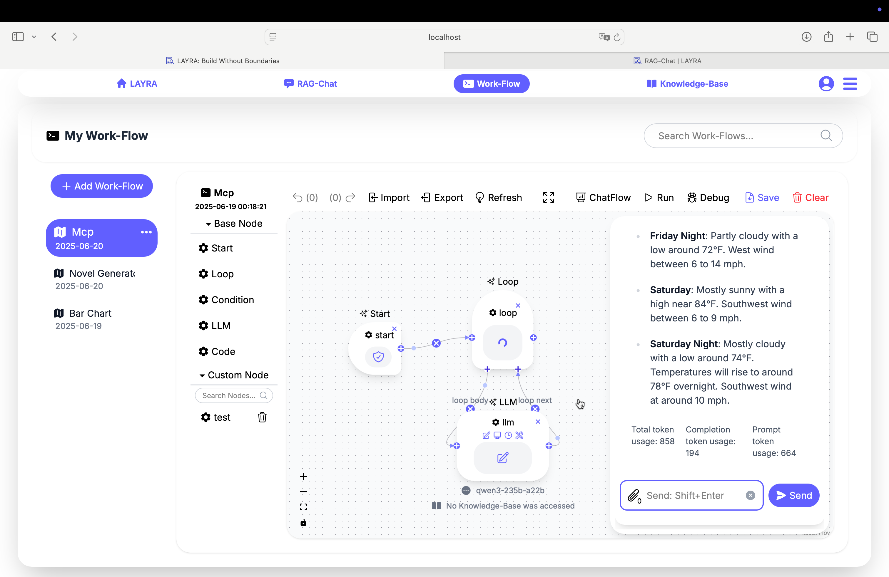
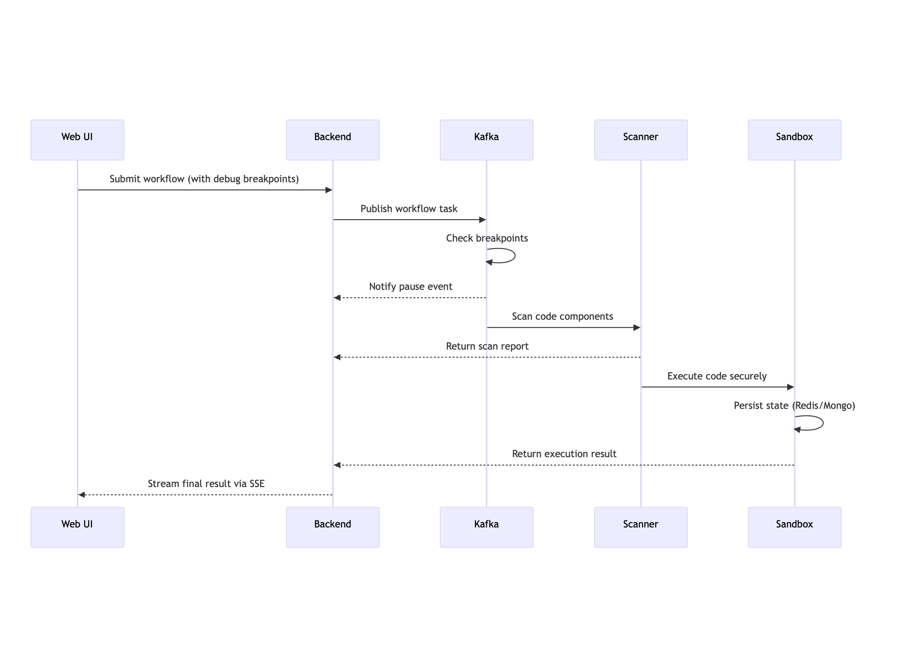

<div align="center">
  
  <h1>🌌 LAYRA: The Visual-First AI Agent Engine That Sees, Understands & Acts</h1>
  <p>
    <a href="https://github.com/liweiphys/layra/stargazers">
      
    </a>
    <a href="https://github.com/liweiphys/layra/blob/main/LICENSE">
      
    </a>
    <a href="https://github.com/liweiphys/layra/issues">
    
  </a>
  </p>
  <p>
    <a href="./README.md">English</a> |
    <a href="./README_zh.md">简体中文</a>
  </p>
</div>

---

**LAYRA** is the world’s first “visual-native” AI automation engine. It **sees documents like a human**, preserves layout and graphical elements, and executes **arbitrarily complex workflows** with full Python control. From vision-driven Retrieval-Augmented Generation (RAG) to multi-step agent orchestration, LAYRA empowers you to build next-generation intelligent systems—no limits, no compromises.

---

## 📚 Table of Contents

- [🚀 Quick Start](#quick-start)
- [❓ Why LAYRA?](#why-layra)
- [⚡️ Core Superpowers](#core-superpowers)
- [🚀 Latest Updates](#latest-updates)
- [🖼️ Screenshots](#screenshots)
- [🧠 System Architecture](#system-architecture)
- [🧰 Tech Stack](#tech-stack)
- [⚙️ Deployment](#deployment)
- [📦 Roadmap](#roadmap)
- [🤝 Contributing](#contributing)
- [📫 Contact](#contact)
- [🌟 Star History](#star-history)
- [📄 License](#license)

---

<h2 id="quick-start">🚀 Quick Start</h2>

#### 📋 Prerequisites

Before starting, ensure your system meets these requirements:

1. **Docker** and **Docker Compose** installed
2. **NVIDIA Container Toolkit** configured (for GPU acceleration)

#### ⚙️ Installation Steps

##### 1. Configure Environment Variables

```bash
# Clone the repository
git clone https://github.com/liweiphys/layra.git
cd layra

# Edit configuration file (modify server IP/parameters as needed)
vim .env

# Key configuration options include:
# - SERVER_IP (server IP)
# - MODEL_BASE_URL (model download source)
```

##### 2. Build and Start Service

```bash
# Initial startup will download ~15GB model weights (be patient)
docker compose up -d --build

# Monitor logs in real-time (replace <container_name> with actual name)
docker compose logs -f <container_name>
```

> **Note**: If you encounter issues with `docker compose`, try using `docker-compose` (with the dash) instead. Also, ensure that you're using Docker Compose v2, as older versions may not support all features. You can check your version with `docker compose version` or `docker-compose version`.

#### 🎉 Enjoy Your Deployment!

Now that everything is running smoothly, happy building with Layra! 🚀✨
*For detailed options, see the [Deployment section](#deployment).*

---

<h2 id="why-layra">❓ Why LAYRA?</h2>

### 🚀 Beyond RAG: The Power of Visual-First Workflows

While LAYRA's **Visual RAG Engine** revolutionizes document understanding, its true power lies in the **Agent Workflow Engine** - a visual-native platform for building complex AI agents that see, reason, and act. Unlike traditional RAG/Workflow systems limited to retrieval, LAYRA enables full-stack automation through:

### ⚙️ Advanced Workflow Capabilities

- **🔄 Cyclic & Nested Structures**  
  Build recursive workflows with loop nesting, conditional branching, and custom Python logic - no structural limitations.

- **🐞 Node-Level Debugging**  
  Inspect variables, pause/resume execution, and modify state mid-workflow with visual breakpoint debugging.

- **👤 Human-in-the-Loop Integration**  
  Inject user approvals at critical nodes for collaborative AI-human decision making.

- **🧠 Chat Memory & MCP Integration**  
  Maintain context across nodes with chat memory and access live information via Model Context Protocol (MCP).

- **🐍 Full Python Execution**  
  Run arbitrary Python code with `pip` installs, HTTP requests, and custom libraries in sandboxed environments.

- **🎭 Multimodal I/O Orchestration**  
  Process and generate hybrid text/image outputs across workflow stages.

### 🔍 Visual RAG: The Seeing Engine

Traditional RAG systems fail because they:

- ❌ **Lose layout fidelity** (columns, tables, hierarchy collapse)
- ❌ **Struggle with non-text visuals** (charts, diagrams, figures)
- ❌ **Break semantic continuity** due to poor OCR segmentation

**LAYRA changes this with pure visual embeddings:**

> 🔍 It sees each page as a whole - just like a human reader - preserving:
>
> - ✅ Layout structure (headers, lists, sections)
> - ✅ Tabular integrity (rows, columns, merged cells)
> - ✅ Embedded visuals (plots, graphs, stamps, handwriting)
> - ✅ Multi-modal consistency between layout and content

**Together, these engines form the first complete visual-native agent platform - where AI doesn't just retrieve information, but executes complex vision-driven workflows end-to-end.**

---

<h2 id="core-superpowers">⚡️ Core Superpowers</h2>

### 🔥 **The Agent Workflow Engine: Infinite Execution Intelligence**

> **Code Without Limits, Build Without Boundaries**
> Our Agent Workflow Engine thinks in LLM, sees in visuals, and builds your logic in Python — no limits, just intelligence.

- **🔄 Unlimited Workflow Creation**  
  Design complex custom workflows **without structural constraints**. Handle unique business logic, branching, loops, and conditions through an intuitive interface.

- **⚡ Real-Time Streaming Execution (SSE)**  
  Observe execution results streamed **live** – eliminate waiting times entirely.

- **👥 Human-in-the-Loop Integration**  
  **Integrate user input** at critical decision points to review, adjust, or direct model reasoning. Enables collaborative AI workflows with dynamic human oversight.

- **👁️ Visual-First Multimodal RAG**  
  Features LAYRA’s proprietary **pure visual embedding system**, delivering lossless document understanding across **50+ formats** (PDF, DOCX, XLSX, PPTX, etc.). The AI actively "sees" your content.

- **🧠 Chat Memory & MCP Integration**

  - **MCP Integration** Access and interact with live, evolving information beyond native context windows – enhancing adaptability for long-term tasks.
  - **ChatFlow Memory** Maintain contextual continuity through chat memory, enabling personalized interactions and intelligent workflow evolution.

- **🐍 Full-Stack Python Control**

  - Drive logic with **arbitrary Python expressions** – conditions, loops, and more
  - Execute **unrestricted Python code** in nodes (HTTP, AI calls, math, etc.)
  - **Sandboxed environments** with secure pip installs and persistent runtime snapshots

- **🎨 Flexible Multimodal I/O**  
  Process and generate text, images, or hybrid outputs – ideal for cross-modal applications.

- **🔧 Advanced Development Suite**

  - **Breakpoint Debugging**: Inspect workflow states mid-execution
  - **Reusable Components**: Import/export workflows and save custom nodes
  - **Nested Logic**: Construct deeply dynamic task chains with loops and conditionals

- **🧩 Intelligent Data Utilities**
  - Extract variables from LLM outputs
  - Parse JSON dynamically
  - Template rendering engine  
    Essential tools for advanced AI reasoning and automation.

### 👁️ Visual RAG Engine: Beyond Text, Beyond OCR

> **Forget tokenization. Forget layout loss.**  
> With pure visual embeddings, LAYRA understands documents like a human — page by page, structure and all.

**LAYRA** uses next-generation Retrieval-Augmented Generation (RAG) technology powered by **pure visual embeddings**. It treats documents not as sequences of tokens but as visually structured artifacts — preserving layout, semantics, and graphical elements like tables, figures, and charts.

---

<h2 id="latest-updates">🚀 Latest Updates</h2>

**(2025.6.2) Workflow Engine Now Available**:

- **Breakpoint Debugging**: Debug workflows interactively with pause/resume functionality.
- **Unrestricted Python Customization**: Execute arbitrary Python code, including external `pip` dependency installation, HTTP requests via `requests`, and advanced logic.
- **Nested Loops & Python-Powered Conditions**: Build complex workflows with loop nesting and Python-based conditional logic.
- **LLM Integration**:
  - Automatic JSON output parsing for structured responses.
  - Persistent conversation memory across nodes.
  - File uploads and knowledge-base retrieve with **multi-modal RAG** supporting 50+ formats (PDF, DOCX, XLSX, PPTX, etc.).

**(2025.4.6) First Trial Version Now Available**:  
 The first testable version of LAYRA has been released! Users can now upload PDF documents, ask questions, and receive layout-aware answers. We’re excited to see how this feature can help with real-world document understanding.

- **Current Features**:
  - PDF batch upload and parsing functionality
  - Visual-first retrieval-augmented generation (RAG) for querying document content
  - Backend fully optimized for scalable data flow with **FastAPI**, **Milvus**, **Redis**, **MongoDB**, and **MinIO**

Stay tuned for future updates and feature releases!

---

<h2 id="screenshots">🖼️ Screenshots</h2>

- ##### LAYRA's web design consistently adheres to a minimalist philosophy, making it more accessible to new users.

Explore LAYRA's powerful interface and capabilities through these visuals:

1. **Homepage - Your Gateway to LAYRA**  
   

2. **Knowledge Base - Centralized Document Hub**  
   

3. **Interactive Dialogue - Layout-Preserving Answers**
   

4. **Workflow Builder - Drag-and-Drop Agent Creation**  
   

5. **Workflow Builder - MCP Example**  
   
   

---

<h2 id="system-architecture">🧠 System Architecture</h2>

LAYRA’s pipeline is designed for **async-first**, **visual-native**, and **scalable document retrieval and generation**.

### 🔍 Query Flow

The query goes through embedding → vector retrieval → anser generation:


### 📤 Upload & Indexing Flow

PDFs are parsed into images and embedded visually via ColQwen2.5, with metadata and files stored in appropriate databases:


### 📤 Execute Workflow (Chatflow)

The workflow execution follows an **event-driven**, **stateful debugging** pattern with granular control:

#### 🔄 Execution Flow

1. **Trigger & Debug Control**

   - Web UI submits workflow with **configurable breakpoints** for real-time inspection
   - Backend validates workflow DAG before executing codes

2. **Asynchronous Orchestration**

   - Kafka checks **predefined breakpoints** and triggers pause notifications
   - Scanner performs **AST-based code analysis** with vulnerability detection

3. **Secure Execution**

   - Sandbox spins up ephemeral containers with file system isolation
   - Runtime state snapshots persisted to _Redis/MongoDB_ for recovery

4. **Observability**
   - Execution metrics streamed via Server-Sent Events (SSE)
   - Users inject test inputs/resume execution through debug consoles



---

<h2 id="tech-stack">🧰 Tech Stack</h2>

**Frontend**:

- `Next.js`, `TypeScript`, `TailwindCSS`, `Zustand`, `xyflow`

**Backend & Infrastructure**:

- `FastAPI`, `Kafka`, `Redis`, `MySQL`, `MongoDB`, `MinIO`, `Milvus`, `Docker`

**Models & RAG**:

- Embedding: `colqwen2.5-v0.2`
- LLM Serving: `Qwen2.5-VL series (or any OpenAI-compatible model)`

---

<h2 id="deployment">⚙️ Deployment</h2>

#### 📋 Prerequisites

Before starting, ensure your system meets these requirements:

1. **Docker** and **Docker Compose** installed
2. **NVIDIA Container Toolkit** configured (for GPU acceleration)

#### ⚙️ Installation Steps

##### 1. Configure Environment Variables

```bash
# Clone the repository
git clone https://github.com/liweiphys/layra.git
cd layra

# Edit configuration file (modify server IP/parameters as needed)
vim .env

# Key configuration options include:
# - SERVER_IP (public server IP)
# - MODEL_BASE_URL (model download source)
```

##### 2. Build and Start Service

```bash
# Initial startup will download ~15GB model weights (be patient)
docker compose up -d --build

# Monitor logs in real-time (replace <container_name> with actual name)
docker compose logs -f <container_name>
```

> **Note**: If you encounter issues with `docker compose`, try using `docker-compose` (with the dash) instead. Also, ensure that you're using Docker Compose v2, as older versions may not support all features. You can check your version with `docker compose version` or `docker-compose version`.

#### 🛠️ Service Management Commands

```bash
# Stop services (preserves data and configurations)
docker compose down

# Full cleanup (deletes databases, model weights and persistent data)
docker compose down -v

# Restart services
docker compose start
```

#### ⚠️ Important Notes

1. **Initial model download** may take significant time (~15GB). Monitor progress:

   ```bash
   docker compose logs -f model-weights-init
   ```

2. **Verify NVIDIA toolkit** installation:

   ```bash
   nvidia-container-toolkit --version
   ```

3. **For network issues**:
   - Manually download model weights
   - Copy to Docker volume: （typically at） `/var/lib/docker/volumes/layra_model_weights/_data/`
   - Create empty `complete.layra` file in both:
     - **`colqwen2.5-base`** folder
     - **`colqwen2.5-v0.2`** folder
   - 🚨 **Critical**: Verify downloaded weights integrity!

#### 🔑 Key Details

- `docker compose down` **`-v` flag warning**: Permanently deletes all databases and models
- **After modifying `.env`**: Rebuild with `docker compose up --build`
- **GPU requirements**:
  - Latest NVIDIA drivers
  - Working `nvidia-container-toolkit`
- **Monitoring tools**:

  ```bash
  # Container status
  docker compose ps -a

  # Resource usage
  docker stats
  ```

> 🧪 **Technical Note**: All components run exclusively via Docker containers.


#### 🎉 Enjoy Your Deployment!

Now that everything is running smoothly, happy building with Layra! 🚀✨

#### ▶️ Future Deployment Options

In the future, we will support multiple deployment methods including Kubernetes (K8s), and other environments. More details will be provided when these deployment options are available.

---

<h2 id="roadmap">📦 Roadmap</h2>

**Short-term:**

- Add Chinese Language Support (coming soon)

**Long-term:**

- Our evolving roadmap adapts to user needs and AI breakthroughs. New technologies and features will be deployed continuously.

---

<h2 id="contributing">🤝 Contributing</h2>

Contributions are welcome! Feel free to open an issue or pull request if you’d like to contribute.  
We are in the process of creating a CONTRIBUTING.md file, which will provide guidelines for code contributions, issue reporting, and best practices. Stay tuned!

---

<h2 id="contact">📫 Contact</h2>

**liweiphys**  
📧 liweixmu@foxmail.com  
🐙 [github.com/liweiphys/layra](https://github.com/liweiphys/layra)  
📺 [bilibili: Biggestbiaoge](https://www.bilibili.com/video/BV17BRUYCEGt?vd_source=8a1b7271cd2e9a7f6a1ae7a781b2e688)  
🔍 微信公众号：LAYRA 项目  
💼 Exploring Impactful Opportunities - Feel Free To Contact Me!

---

<h2 id="star-history">🌟 Star History</h2>

[](https://www.star-history.com/#liweiphys/layra&Date)

---

<h2 id="license">📄 License</h2> 

This project is licensed under the **Apache License 2.0**. See the [LICENSE](./LICENSE) file for more details.

---

> _Endlessly Customizable Agent Workflow Engine - Code Without Limits, Build Without Boundaries._
