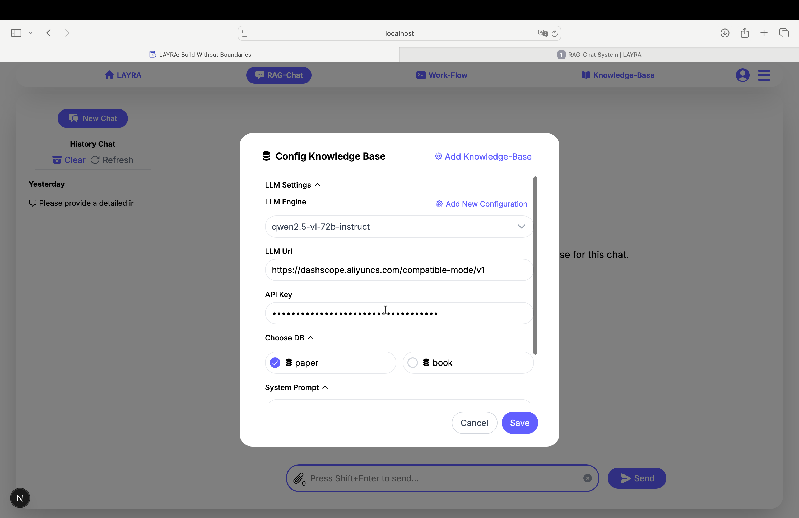
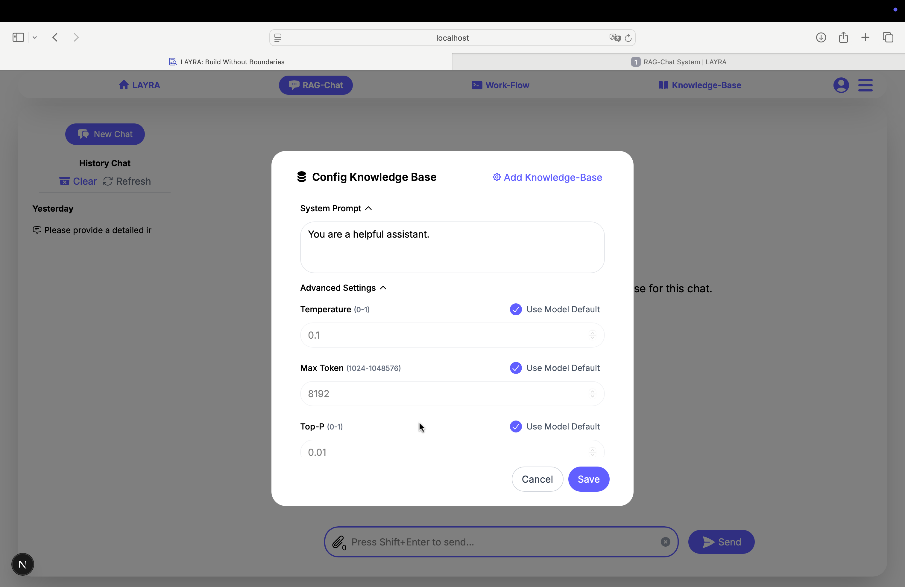
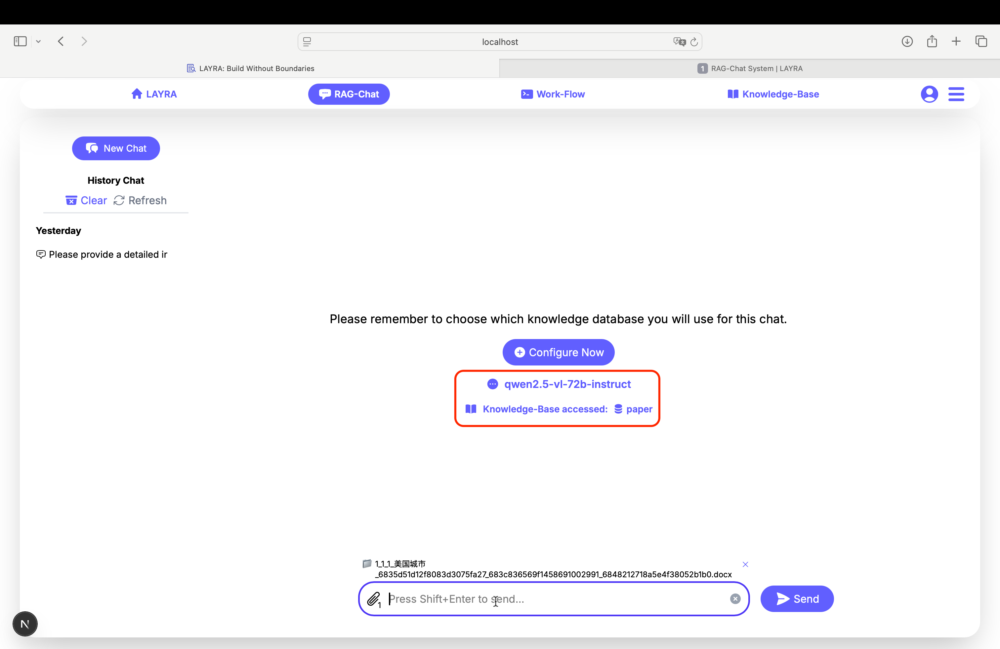
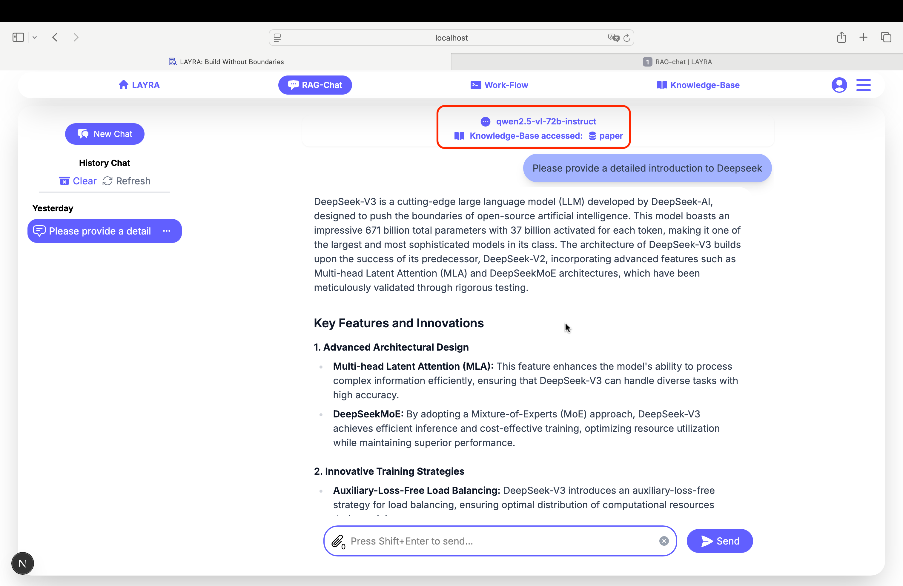
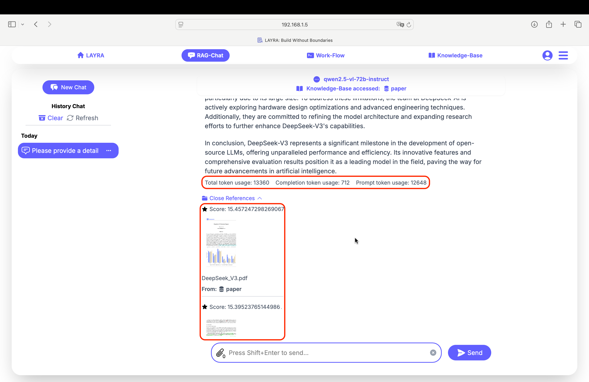
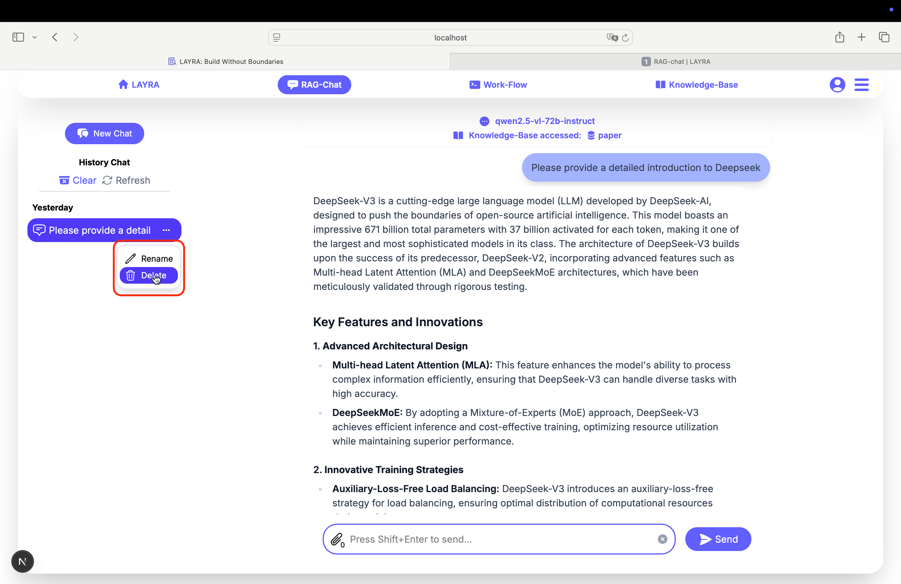

# RAG-Chat

Our advanced **vision-based multimodal RAG-Chat system** enables **AI-powered conversations** with flexible knowledge integration. Choose from these interaction modes:  
- Standard conversations without RAG  
- RAG-enabled conversations using single or multiple knowledge bases  
- Instant RAG conversations with uploaded files  
- Hybrid mode combining document uploads with knowledge base retrieval  

--- 

Before proceeding, ensure you've configured your preferred LLM and knowledge base by clicking the **Config Now** button in the center-right section.  

---

## Configuring Knowledge Base and LLM  

Click the **Config Now** button (center-right section) to access the Knowledge Base Configuration panel.  
  

---  

### Configuration Panel - Upper Section  
  

**Add Knowledge-Base**
- Redirects to the knowledge base management interface (refer to previous tutorial section)  

**LLM Settings Section**:  
- **LLM Engine**: Select your preferred large language model  
- **Add New Configuration**: Create custom LLM configurations (supports OpenAI-compatible APIs)  
- **LLM Url**: Endpoint URL for OpenAI-compatible APIs  
- **API Key**: Your LLM service authentication key  

**Knowledge Base Selection**:  
- Multi-select knowledge bases using checkboxes  

:::important SYSTEM REQUIREMENT  
LAYRA's vision-based multimodal RAG system requires your LLM to support visual inputs (VLM capability) for full RAG functionality.  
:::

:::tip LOCAL DEPLOYMENT NOTE  
When using locally hosted models, you may enter any placeholder text in the **API Key** field.  
:::

---  

### Configuration Panel - Lower Section  
  

**System Prompt**:  
- Contains the LLM's system instructions (Pro Tip: Well-crafted prompts significantly improve response quality)  

**Advanced Settings**:  
- **Use Model Default**: Applies default server-side configurations  
  - LLM: Preserves original model parameters  
  - RAG: Defaults to Top-K=3 and Score Threshold=10  
- **Temperature** (0-1): Controls response creativity  
- **Max Token** (1024-1048576): Response length limit  
- **Top-P** (0-1): Probability mass sampling parameter  
- **Knowledge-Base Top-K** (1-30): Retrieved passages quantity  
- **Retrieval Score Threshold** (0-20): Minimum relevance score  

:::tip RECOMMENDATIONS  
**For Beginners**:  
- Default settings provide optimal balance for most use cases  
- Each +1 in **Top-K** adds ~1000 tokens - adjust according to your compute resources  
- Recommended **Top-K** values: 10 (resource-rich) or 3 (resource-constrained)  

**For Learners**:  
- Consult your LLM to understand each advanced parameter's effect through interactive Q&A  
:::  

---

## Chat Interface

After configuring and saving your LLM and knowledge base settings, you're ready to start conversations. The current LLM and selected knowledge bases will be displayed below the **Config Now** button.

LAYRA supports the following conversation modes with identical user experience:

### Standard Chat (No RAG)
When no files are uploaded and no knowledge bases selected:
- Pure LLM conversation
- No knowledge base integration
- Fastest response time

### RAG Mode
1. **Single Knowledge Base**:
When selecting one knowledge base:
   - Retrieves from one selected source
   - Best for focused topics

2. **Multiple Knowledge Bases**:
When selecting multiple knowledge bases:
   - Combine information from several sources
   - Enable by checking multiple Knowledge Bases in sidebar

3. **Temporary Files**:
When uploading files:
   - Use uploaded files just for current chat
   - Doesn't affect permanent knowledge bases

4. **Hybrid Mode (Files + Knowledge Bases)**:
When uploading files AND selecting knowledge bases:
   - Combines temporary files with permanent knowledge bases
   - Provides most comprehensive context

The chat interface displays the current LLM and called knowledge bases above each response.

---

Responses include token usage statistics and RAG citations at the end, sorted by relevance with:
- Relevance score
- Document source
- Knowledge base origin

**Token Usage Breakdown**:
- Total token usage
- Completion token usage
- Prompt token usage

:::important NOTE
LAYRA applies score threshold filtering to both uploaded files and knowledge base retrievals. Only content scoring above the threshold will be recalled. 

To analyze complete documents:
1. Set score threshold to 0
2. Ensure Top-K exceeds document page count
:::

## Conversation History

Access previous conversations via the left sidebar:
- Click conversations to view history
- Click the three-dot menu to rename or delete conversations

:::danger WARNING
Deleted conversations cannot be recovered.
:::

---

## Next Steps
Explore LAYRA's most powerful feature - **Agent Workflow Orchestration** with visual RAG capabilities.
