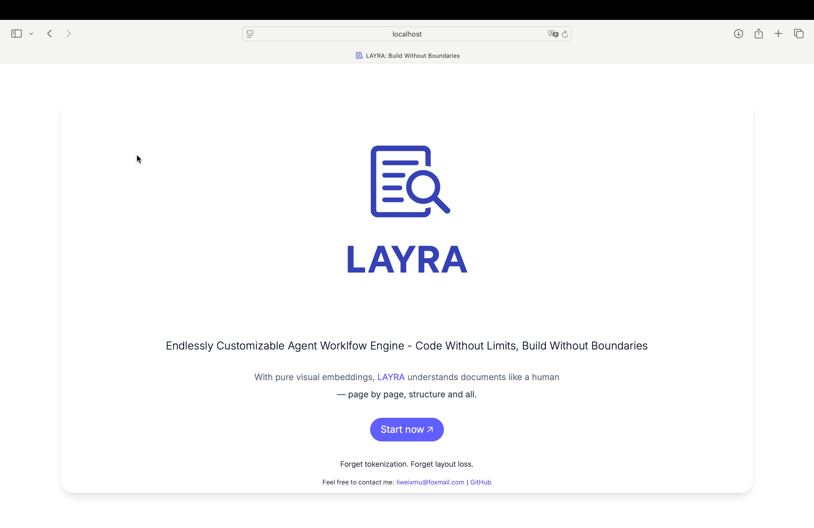

# Quick Start
Let's discover **LAYRA in under 10 minutes** - the visual-native AI agent engine that sees, understands, and acts.

---
## Getting Started

Deploy LAYRA with Docker to unlock its full visual-first RAG and Workflow capabilities:

### What You'll Need
1. **Docker** and **Docker Compose**  
   ([Installation Guide](https://docs.docker.com/engine/install/))  
2. **NVIDIA GPU** with drivers and **NVIDIA Container Toolkit**  
   ([Setup Instructions](https://docs.nvidia.com/datacenter/cloud-native/container-toolkit/latest/install-guide.html))  
3. 15GB+ free disk space (for AI models)

---

### Deployment Steps  
##### 1. Clone Repository & Configure  
```bash
git clone https://github.com/liweiphys/layra.git
cd layra
vim .env  # Edit key parameters (SERVER_IP, MODEL_BASE_URL)
```

##### 2. Launch Services (First run downloads ~15GB models)  
```bash
docker compose up -d --build
```

:::tip NOTE

If you encounter issues with `docker compose`, try using `docker-compose` (with the dash) instead. Also, ensure that you're using Docker Compose v2, as older versions may not support all features. You can check your version with `docker compose version` or `docker-compose version`.

:::

##### 3. Monitor Model Weight Initialization  
```bash
docker compose logs -f model-weights-init
```
> **Be patient** - Initial model download takes 15-25 mins depending on network speed. Grab a coffee!

---

### Verify Installation  
1. Check running services:  

After running `docker compose up -d --build`, check container status with:

```bash
docker compose ps -a
```

**Successful installation will show:**  
```text
NAME                         IMAGE                                      STATUS                      
layra-backend-1              layra-backend                              Up (healthy)              
layra-frontend-1             layra-frontend                             Up                        
layra-kafka-1                bitnami/kafka:3.8.0                        Up (healthy)              
layra-kafka-init-1           layra-kafka-init                           Exited (0)                
layra-milvus-etcd-1          quay.io/coreos/etcd:v3.5.18                Up (healthy)              
layra-milvus-minio-1         minio/minio                                Up (healthy)              
layra-milvus-standalone-1    milvusdb/milvus:v2.5.6                     Up (healthy)              
layra-minio-1                minio/minio                                Up (healthy)              
layra-model-server-1         layra-model-server                         Up (healthy)              
layra-model-weights-init-1   layra-model-weights-init                   Exited (0)                
layra-mongodb-1              mongo:7.0.12                               Up (healthy)              
layra-mysql-1                mysql:9.0.1                                Up (healthy)              
layra-nginx-1                nginx:alpine                               Up                        
layra-python-sandbox-1       python-sandbox                             Exited (0)                
layra-redis-1                redis:7.2.5                                Up (healthy)              
```

:::tip Key indicators of success
1. **10+ containers** in `Up (healthy)` status  
2. **Init containers** (`kafka-init`, `model-weights-init`, `python-sandbox`) show `Exited (0)` (successful exit)  
3. **No error messages** in status column  
4. **Nginx** exposes port 80 (web UI access)
:::
---

### Access Your LAYRA Instance
Open your browser and visit:  
`http://<your-server-ip>` (Default port 80)

You should see:  



---

## Troubleshooting Tips  
If services fail to start:  
```bash
# Check container logs:
docker compose logs <container name>
```

Common fixes:
```bash
nvidia-smi  # Verify GPU detection
docker compose down -v && docker compose up --build  # Full rebuild
```

:::danger Take care

 **`-v` flag**: Permanently delete all databases and model weights.

:::

:::tip Pro Tip
 For faster subsequent launches, run `docker compose stop` instead of `down` to preserve models.
:::
---

## Next Steps  
1. Upload documents in **Knowledge Base**  
2. Try visual Q&A in **Chat**  
3. Build agents in **Workflow**  

> **Congratulations!** You're now running the world's first visual-native AI agent engine. 🚀  