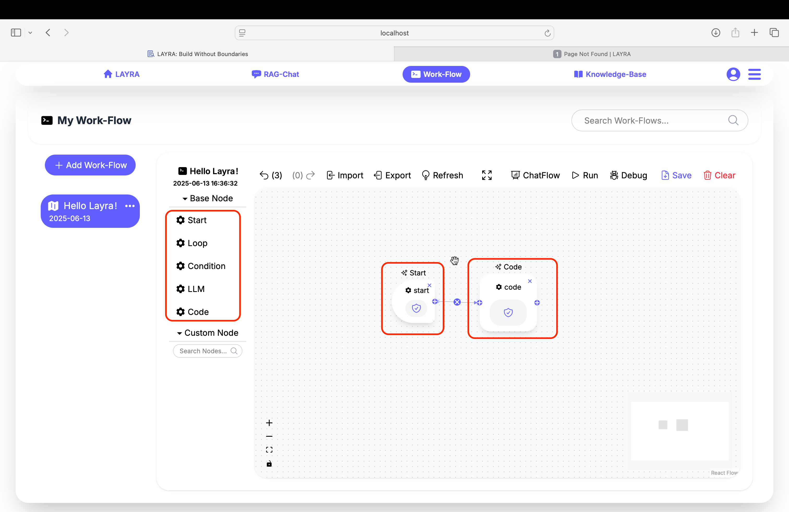
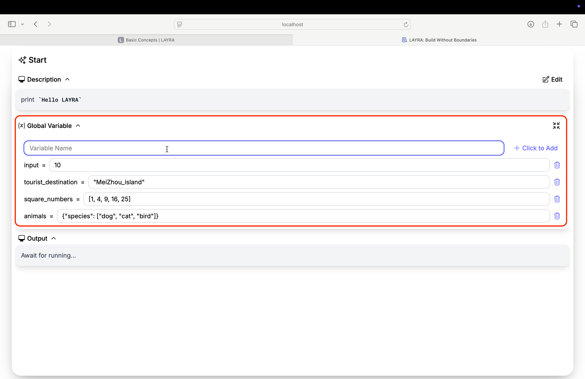
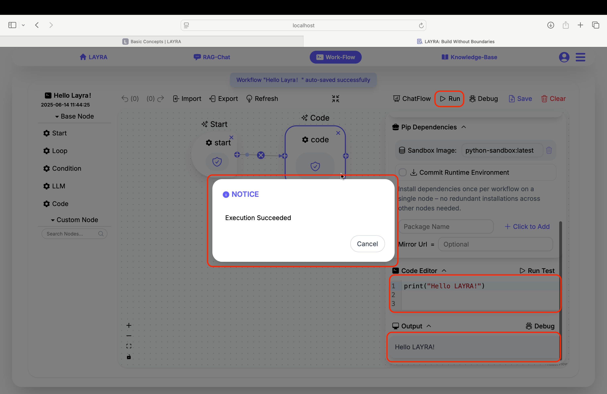

# Basic Concepts

LAYRA's **Agent Workflow Engine** enables you to build arbitrarily complex AI automation pipelines through intuitive visual programming. This section introduces fundamental concepts before you start creating your own workflows.

---

## Understanding Agent Workflows

An **Agent Workflow** is a sequence of interconnected nodes that defines:

1. **Multi-step AI processes** combining LLM reasoning, data operations, and action execution
2. **Custom logic flows** with conditional branches, loops, and human interaction points
3. **Context-aware operations** that maintain state throughout execution

Unlike RAG systems, workflows handle **stateful operations** where outputs from one node dynamically become inputs to subsequent nodes.

---

## LAYRA's Workflow Design Philosophy

LAYRA maintains a minimalist design ethos **that features:**

- **Clean UI** with minimal visual clutter
- Only **5** core node types for rapid onboarding
- Fully **customizable** foundational components

Unlike alternatives with complex interfaces and dozens of node types, LAYRA provides just:

1. Start Node
2. Four functional primitives (LLM, Code, Condition, Loop)

These building blocks enable you to construct sophisticated agent "machines" through creative combinations. When mastered, they form **agent-era Turing-complete systems** capable of orchestrating any computable operation - including **reasoning, decision-making, and real-world action execution**.

:::tip Key capabilities

- **Cognitive Automation**: LLM-powered reasoning chains
- **Action Orchestration**: Real-world task execution
- **Dynamic Adaptation**: Context-aware operation flows
  :::

### Variables: The Workflow Lifeblood

Consider workflows as factories:

- **Nodes** = Assembly machines
- **Variables** = Materials/products moving through production lines

LAYRA implements **global variables** with shared access across all nodes. This eliminates artificial input/output distinctions and aligns with standard programming paradigms:

```python
# 1. Define global variables
sum = []
a_1 = 1
b_1 = 1
b_2 = 2

# 2. First calculation
sum.append(a_1 + b_1)  # Node 1 operation

# 3. Second calculation
sum.append(a_1 + b_2)  # Node 2 operation

# 4. Output: [2, 3]
print(sum)
```

This approach avoids cumbersome input/output definitions required in other node-based systems.

:::tip For example
**Other node-based workflow systems** require you to define inputs like `a_1 = 1` and `b_1 = 1` for the first node to output `sum_1 = 2`, then define `a_1 = 1` and `b_2 = 2` for a second node to output `sum2 = 3`, and finally needing a separate merge node to combine `sum1` and `sum2` into `sum = [2, 3]`.
:::

---

## Essential Components

With this understanding of LAYRA's design philosophy, let's explore the core concepts: **Nodes**, **Connections**, and **Global Variables**.

### 1. Nodes



The foundational building blocks of all workflows. Each node type serves a distinct purpose:

- **Start Nodes**: Define workflow entry points
- **LLM Nodes**: Handle all large language model operations including text generation, decision-making, MCP execution, function calls, RAG integration, and chatflow I/O
- **Code Nodes**: Execute Python scripts with pip package support, network access, and full native Python capabilities (with security safeguards)
- **Condition Nodes**: Create decision branches (if/else logic)
- **Loop Nodes**: Enable repetitive operations (for/while loops)

:::important Why Only Five Node Types?

- LAYRA maintains a minimalist design philosophy for enhanced accessibility while preserving powerful extensibility
- Users can unlock unlimited potential through Python scripting in code nodes and LLM parameter tuning
- Custom nodes can be developed and published by advanced users
- Beginners can leverage official templates for zero-code development
  :::

### 2. Connections

Define data flow between nodes through:

- **Input/Output Ports**: Data transfer interfaces on nodes
- **Connection Lines**: Visual links representing execution paths

:::tip DIRECTIONAL FLOW
Solid blue circles moving along connection lines indicate both execution sequence and data transfer direction
:::

### 3. Global Variables

**Persistent storage for workflow data:**  
Supports all Python-defined variable types, enabling complex operations in code nodes for maximum development flexibility. Moreover, global variables can store LLM outputs through direct assignment (advanced "magic" assignment features will be explored in later sections).

```python
# Access context anywhere in your workflow
input = 10  # integer
tourist_destination = "MeiZhou_island"  # string
square_numbers = [1, 4, 9, 16, 25]  # list
animals = {"species": ["dog", "cat", "bird"]}  # dictionary
...
```



---

## Create Your First LAYRA Workflow

Now that you understand these core concepts, let's build your first LAYRA workflow!

### Hello LAYRA

Just as every programmer begins with "Hello World", your LAYRA journey starts with printing "Hello LAYRA". Follow these three simple steps:

1. **Build the Flow**  
   From the left node panel:

   - **Click** the `start` node to add it to the canvas.
   - **Then, add** a code node.
   - **Finally, connect** the `start` node's output port to the `code` node's input port.

2. **Implement Your Logic**  
   Select the `code` node and navigate to the `Code Editor` tab:

   ```python
   print("Hello LAYRA!")
   ```

   Click the `Run` button in the canvas toolbar

3. **Verify Execution**  
   Wait for the `Execution Succeeded` notification. Check the `Output` panel:
   ```
   Hello LAYRA!
   ```



🎉 **Congratulations!** You've built your first LAYRA workflow!

## Next Steps  
Next, let's dive deeper into the functionality of nodes!
