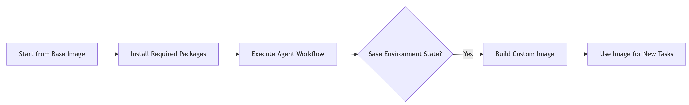
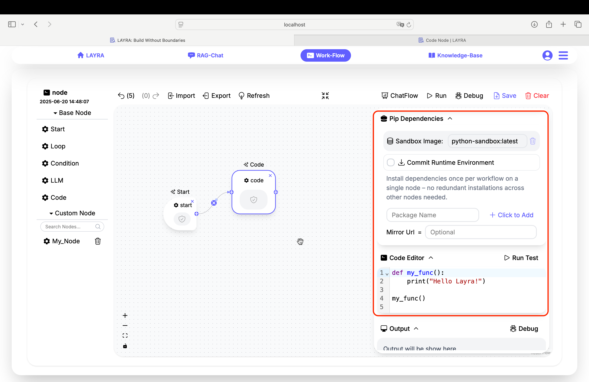
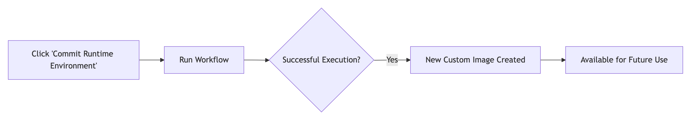
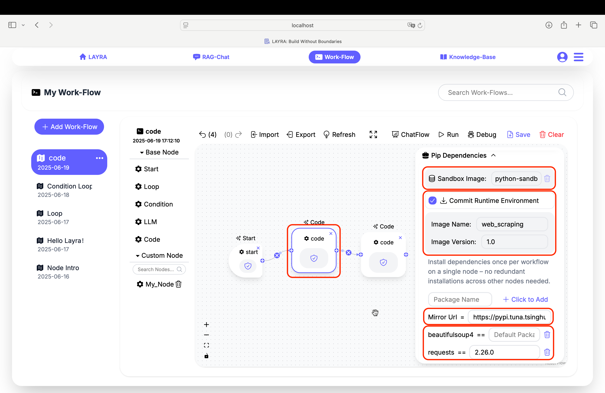
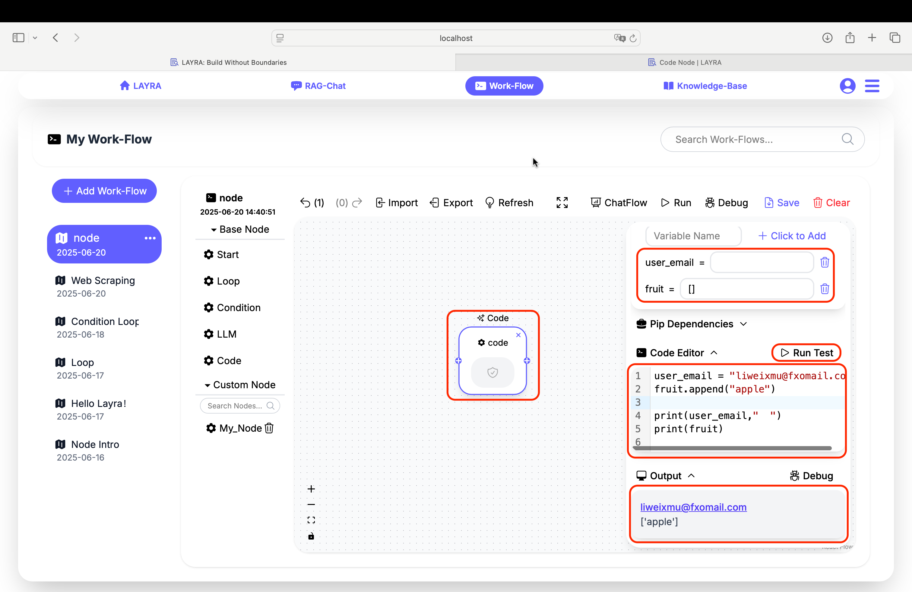
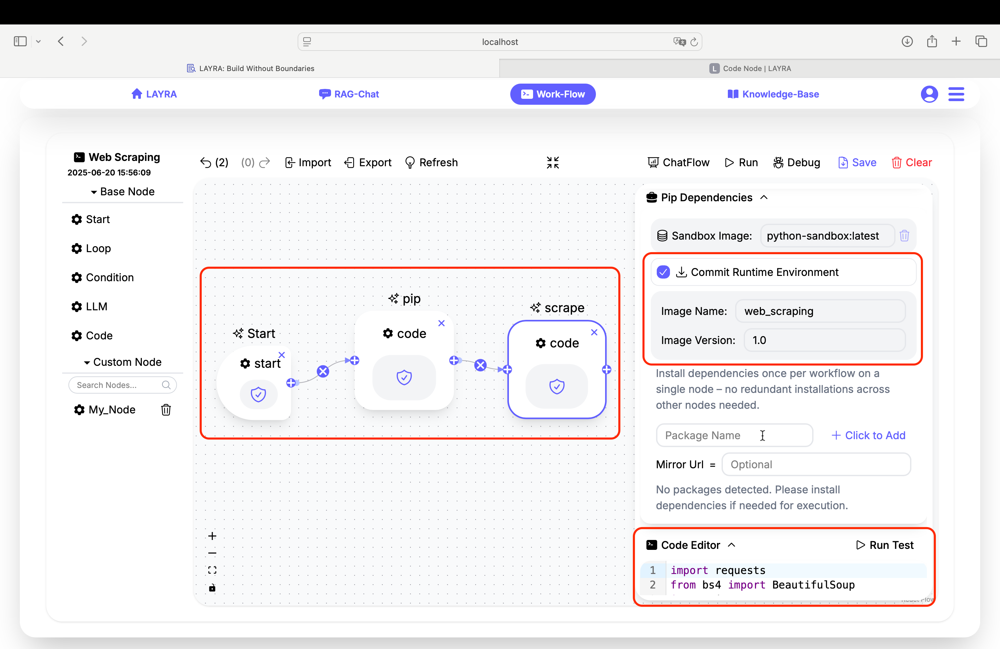
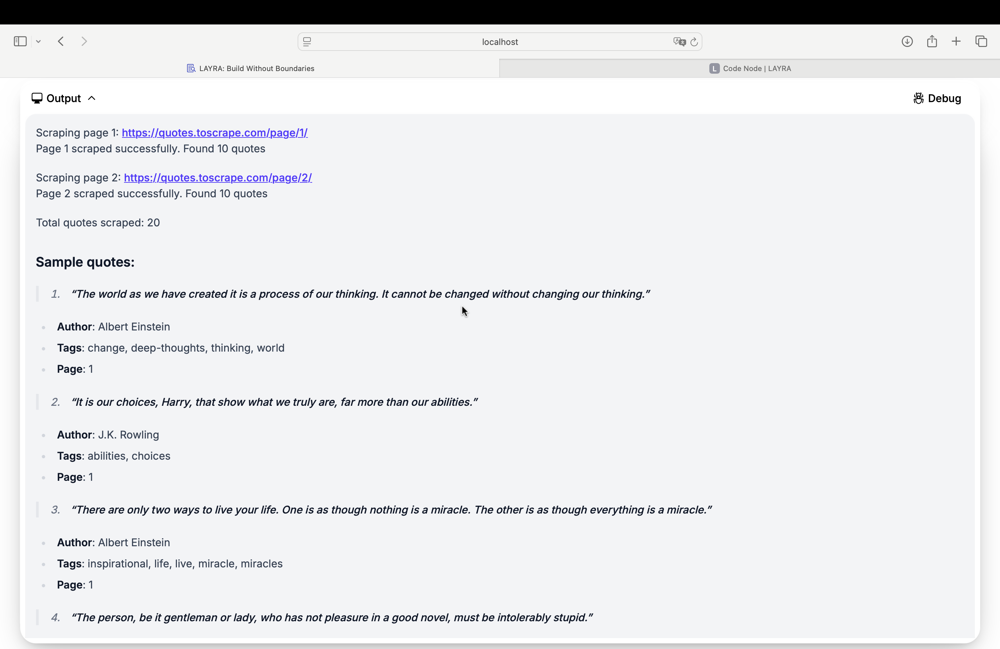
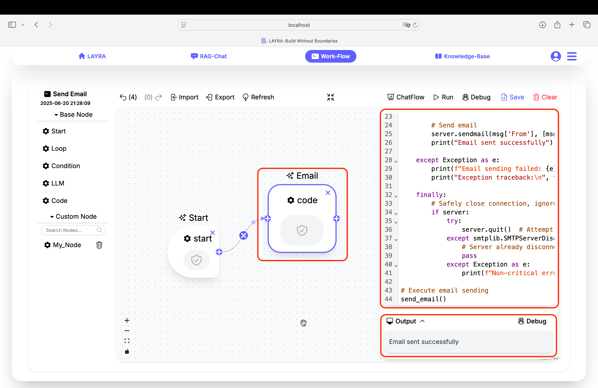
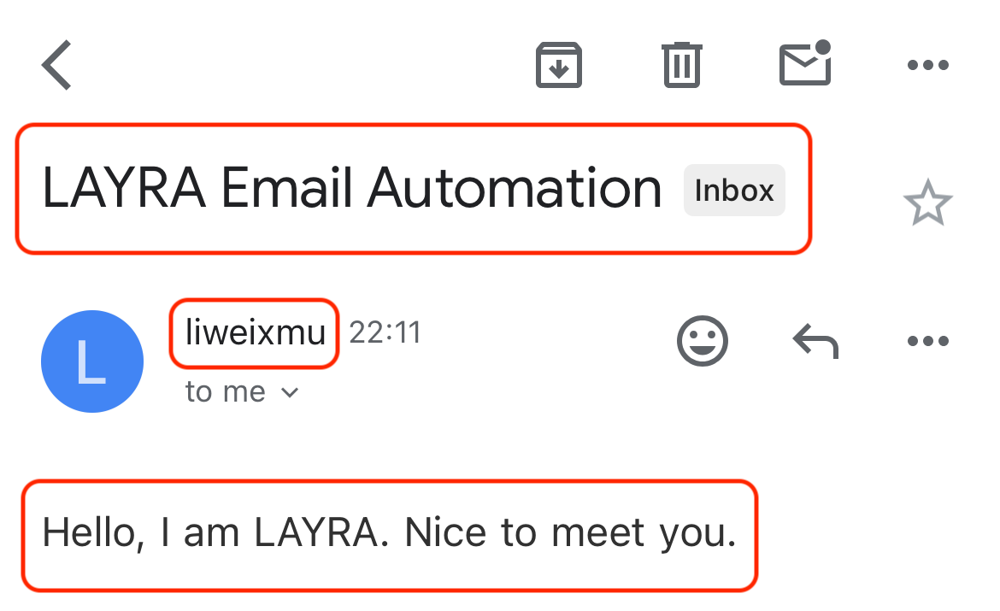

# Code Node

The **Code Node** is a powerful execution environment that enables you to run custom Python code within your workflow. Operating within a secure sandbox with internet access, it supports features such as HTTP requests, web scraping, email automation, social media integration, and advanced manipulation of complex **Global Variables** and data processing.

---

## Core Features

### 1. Secure Execution Environment

- Runs in an isolated sandbox with network access
- Preserves system integrity while allowing external operations
- Supports both synchronous and asynchronous Python code

### 2. Dependency Management

- Install any Python package via **Pip Dependencies**
- Accelerate installations with custom **Mirror URLs**
- Save modified environments as reusable custom images with **Commit Runtime Environments**
- Select custom environments using **Sandbox Images**



### 3. Full Python Capabilities

- Manipulate workflow **Global Variables**
- Execute complex operations like web scraping
- Integrate with APIs and external services
- Perform data processing



---

## Dependency Configuration

### Pip Dependencies

1. Enter package names and click `Click to Add` to add required dependencies  
   _(Add dependencies one by one)_
2. Optional version specification:

   ```python
   # Examples:
   beautifulsoup4
   requests==2.26.0
   ```

:::important Important
`Pip packages` are shared across the entire workflow. This means you only need to install them once on the first node, and subsequent nodes can access them.
:::

### Sandbox Images

- **Base Image**: `python-sandbox:latest` (built on Python 3.12)
- **Custom Images**: Create your own by:  
  a) Selecting the `Commit Runtime Environment` checkbox  
  b) Specifying your custom `Image Name` and `Image Version`

:::important Important

1. `Image Name` must be lowercase
2. `Commit Runtime Environment` will save **all dependencies** (both newly added and existing ones in the current runtime image). This means you can repackage the image based on your custom image.
3. `Sandbox Images` are **shared across the entire workflow**. Any image specified in any Code node will be **globally effective** for all nodes in this workflow.  
   :::



### Mirror Acceleration

Add mirror URLs to accelerate pip installations:

```python
# Example mirrors for Chinese users:
https://pypi.tuna.tsinghua.edu.cn/simple
https://mirrors.aliyun.com/pypi/simple/
```

:::tip TIP
After saving the new image, when running a new workflow:

1. Select the new image via **Sandbox Image**
2. Uncheck the `Commit Runtime Environment` checkbox ( _This prevents accidental overwriting of the newly saved image._ )
   :::



---

## Code Editor

The editor provides full Python 3.12 support with:

- Syntax highlighting
- Basic code completion
- No artificial formatting restrictions beyond Python's syntax rules

### Global Variable Access

Manipulate workflow variables directly:

```python
# Get and modify variable
user_email = "liweixmu@fxomail.com"
fruit.append("apple")

print(user_email,"  ")
print(fruit)
```

:::tip TIP
Leverage **LLMs** to assist you in writing standardized `Python code`.
:::

### Run Test Feature

Validate code without executing the full workflow:

1. Click **Run Test** in the editor header
2. View execution results in the **Output** panel



:::tip Note
The **Output** panel uses Markdown rendering. While Python's default `print()` ends with "\n", Markdown requires "&nbsp;&nbsp;\n" to render line breaks properly. It's recommended to add two spaces to ensure correct Markdown line breaks. For example:

```python
print("hello world") → print("hello world  ")
```

:::

---

## Practical Examples

Next, let’s look at two slightly more complex examples. The first involves web scraping, and the second focuses on email delivery. You can treat these as specific instances of pre-processing and post-processing in the upcoming **LLM Node** chapter:

- Use a web scraper to gather input data
- Feed this information to an LLM for summarization and filtering
- Call the next node to send the curated content to your email

**Once you master the next chapter, you'll be able to build an Agent application that automatically scrapes and delivers news updates.**

The same workflow can be adapted beyond emails. For instance:

- Replace email delivery with automated social media posting
- Scrape trending content from Platform A
- Process it through an LLM for refinement
- Autonomously publish to Platform B

:::warning Important Note
Always ensure compliance with legal requirements:

- Only scrape content explicitly permitted for republication
- Respect platform `robots.txt` crawling policies
- Unauthorized scraping may result in legal consequences
  :::

### 1. Web Scraping

**Important Best Practice**:  
Isolate pip installations in a dedicated node. After saving the new image, delete the pip node before subsequent executions to optimize workflow.

#### Step 1: Dependency Installation Node

Create a dedicated `pip` node to install dependencies and save as a new image `web_scraping:1.0`:

```python
# PIP REQUIREMENTS
beautifulsoup4
requests==2.26.0
```

#### Step 2: Web Scraping Execution Node

Scrape quote data from `https://quotes.toscrape.com` (pages 1-2):

```python
import requests
from bs4 import BeautifulSoup
import json

def scrape_quotes_toscrape():
    base_url = "https://quotes.toscrape.com"
    scraped_quotes = []

    # Scrape first two pages
    for page_num in range(1, 3):
        url = f"{base_url}/page/{page_num}/"
        print(f"Scraping page {page_num}: {url}  ")

        # Fetch page content
        response = requests.get(url)
        if response.status_code != 200:
            print(f"Failed to scrape page {page_num}. Status: {response.status_code}  ")
            continue

        # Parse HTML
        soup = BeautifulSoup(response.text, 'html.parser')
        quotes = soup.select('div.quote')

        # Extract quote data
        for quote in quotes:
            text = quote.select_one('span.text').text.strip()
            author = quote.select_one('small.author').text.strip()
            tags = [tag.text for tag in quote.select('a.tag')]

            scraped_quotes.append({
                'quote': text,
                'author': author,
                'tags': tags,
                'page': page_num
            })

        print(f"Page {page_num} scraped. Quotes found: {len(quotes)}\n")

    # Output summary
    print(f"✅ Total quotes scraped: {len(scraped_quotes)}  ")
    return scraped_quotes

# Execute scraping
quotes_data = scrape_quotes_toscrape()

# Display sample results
print("\n### Sample Output:")
for i, item in enumerate(quotes_data[:5], 1):
    print(f"> QUOTE {i}: {item['quote']}  ")
    print(f"   - **Author**: {item['author']}  ")
    print(f"   - **Tags**: {', '.join(item['tags'])}  ")
    print(f"   - **Source Page**: {item['page']}\n  ")
```



#### Expected Output

Upon successful execution, the node will display scraped quotes with metadata:



---

### 2. Email Automation  

#### Automatically Sending Emails  
**Prerequisites:**  
Enable SMTP service for your email account (using Foxmail as an example):  
Log in to your email account → Settings → Account → Enable POP3/SMTP Service  
Obtain an **Authorization Code** (used in place of your password).  

**Code Node for Automated Email Sending:**  

```python
import smtplib, traceback
from email.mime.text import MIMEText
from email.mime.multipart import MIMEMultipart
from email.utils import formatdate

def send_email():
    server = None
    try:
        # ===== Configure Email Content =====
        msg = MIMEMultipart()
        msg['From'] = 'sender@example.com'  # Replace with sender email
        msg['To'] = 'recipient@example.com'  # Replace with recipient email
        msg['Subject'] = 'LAYRA Email Automation'  # Email subject
        msg['Date'] = formatdate(localtime=True)

        # Add email body
        body = MIMEText('Hello, I am LAYRA. Nice to meet you.', 'plain', 'utf-8')
        msg.attach(body)

        # ===== Establish SSL Connection =====
        server = smtplib.SMTP_SSL('smtp.example.com', 465)  # Replace with SMTP server
        server.login('sender@example.com', 'your_authorization_code')  # Use your authorization code

        # Send email
        server.sendmail(msg['From'], [msg['To']], msg.as_string())
        print("Email sent successfully")

    except Exception as e:
        print(f"Email sending failed: {e}")
        print("Exception traceback:\n", traceback.format_exc())

    finally:
        # Safely close connection (ignore quit errors)
        if server:
            try:
                server.quit()  # Attempt graceful exit
            except smtplib.SMTPServerDisconnected:
                # Server already disconnected
                pass
            except Exception as e:
                print(f"Non-critical error during connection closure: {e}")

# Execute email sending
send_email()
```  

If the email is sent successfully, the **Output** will display: `Email sent successfully`  
  

#### Receiving LAYRA's Email  
Check your inbox to find a "Hello" email successfully sent by LAYRA:  
  

#### Next Step  
In the next section, we will extract sender/recipient information as **Global Variables** and integrate an **LLM Node** to build an automated workflow.  

---

## Advanced Usage

### Error Handling

Implement try-except blocks for robustness:

```python
try:
    response = requests.get(url, timeout=10)
    response.raise_for_status()
except requests.exceptions.RequestException as e:
    error = str(e)
    print(e) # Optional: Print
    # Graceful fallback logic here
```

### Asynchronous Operations

Use async functions for high concurrency:

```python
import aiohttp
import asyncio

async def fetch_data(url):
    async with aiohttp.ClientSession() as session:
        async with session.get(url) as response:
            return await response.text()

async def main():
    # Use asyncio.gather to run multiple async tasks concurrently
    results = await asyncio.gather(
        fetch_data('https://api.example.com/data1'),
        fetch_data('https://api.example.com/data2')
    )
    return results

# Run the async main function using asyncio.run
if __name__ == '__main__':
    results = asyncio.run(main())
    print(results)  # Optional: Print
    # Optional: process results here
```

> Another powerful development tool is the **Node-Level Debugging** capability for workflows, which will be covered in the **[Workflow](../workflow)** section.

---

## Best Practices

1. **Test Incrementally**: Use **Run Test** frequently during development
2. **Manage Dependencies**: Commit custom images after testing new packages
3. **Handle Secrets**: Store credentials in global variables → NEVER hardcode
4. **Limit Scope**: Keep single-purpose code in each node
5. **Add Timeouts**: For network operations:
   ```python
   requests.get(url, timeout=(3.05, 15))  # Connect + read timeouts
   ```

:::tip PERFORMANCE TIP  
For recurring operations:

1. Install dependencies in base image
2. Commit environment
3. Reuse custom image → Skip installation phase  
   :::

---

## Next Steps

**LLM Node** for powerful Agent Workflow

> **Coming Soon** :Explore [Template Gallery](../template-gallery) for prebuilt automation solutions!
