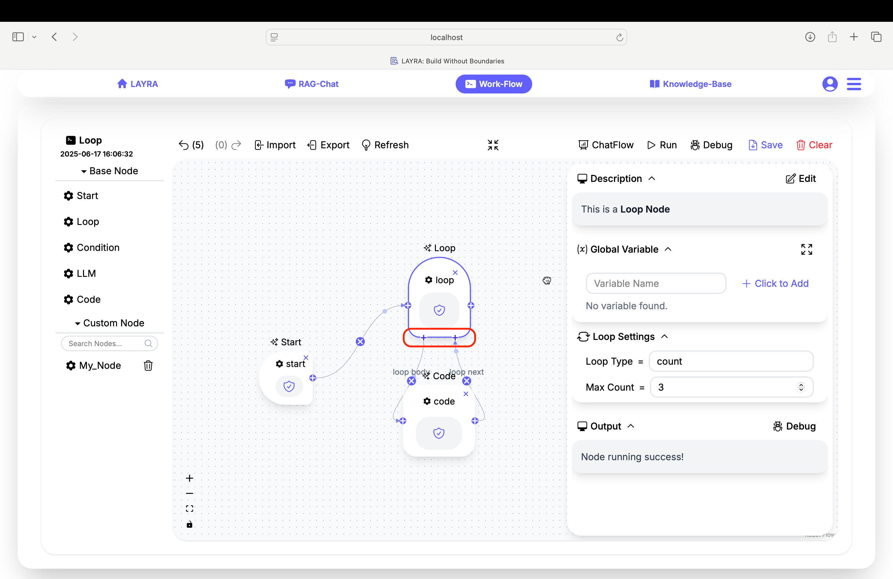
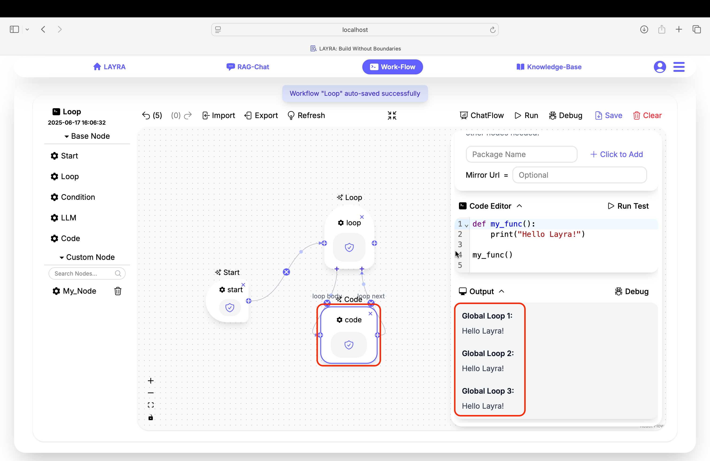
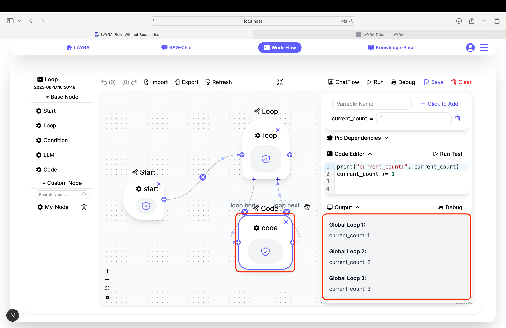
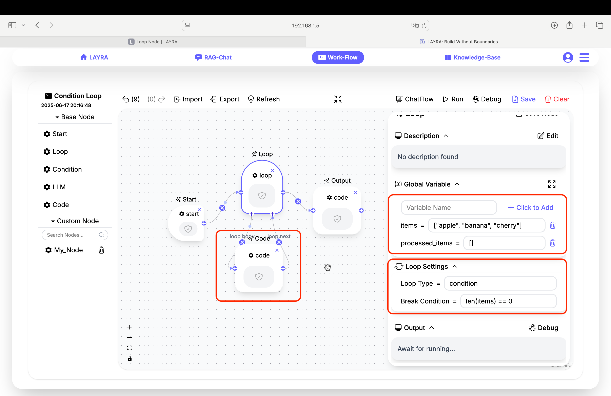
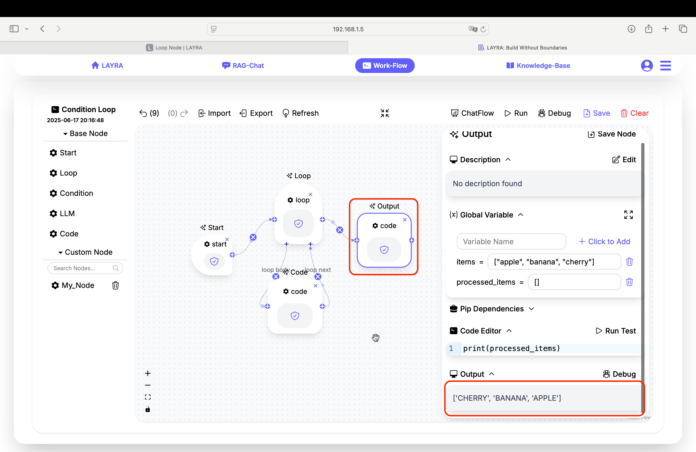
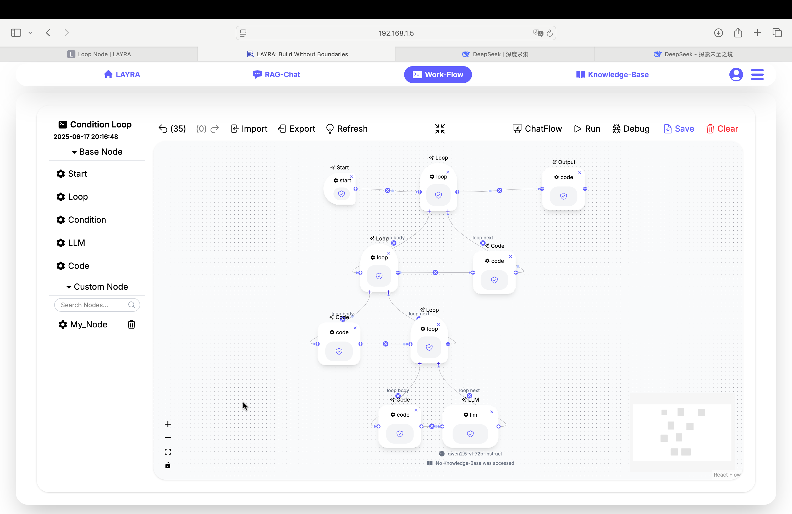

# Loop Node

In this section, we'll explore the **Loop Node**, which functions similarly to `for` and `while` loops in programming languages, enabling repetitive execution of workflow segments.

---

## Basic Loop Logic

Start by adding a Start Node to your workflow, then connect it to a Loop Node. Unlike other nodes, the Loop Node requires at least one child node to form its **loop body**. This body will execute repeatedly based on your loop configuration.



Select the Loop Node to reveal its configuration panel. You'll find the **Loop Settings** section with two loop types:

1. **Count Loop**  
   Executes a fixed number of iterations
2. **Condition Loop**  
   Executes while a break condition remains false

:::note NO TESTING OPTION
Loop Nodes lack a **Run Test** button for **node-level testing** since they require a loop body to function meaningfully.
:::

---

## Count Loop Configuration

When selecting **Count** as your loop type:

- Set the **Max Count** field to determine iterations

### Example: Simple Counter

```python
Max Count = 3
```
This configuration will execute the loop body exactly three times, with `Global Loop` values: 1, 2, 3.



---

## Condition Loop Configuration

When selecting **Condition** as your loop type:

1. Define your **Break Condition** using a Python expression
2. The loop continues while this condition evaluates to `False`
3. Breaks immediately when condition becomes `True`

### Example: Countdown Loop

```python
# Global Variable
current_count = 1

# Break Condition
current_count > 3

# Code Editor
print("current_count:", current_count)
current_count += 1

```
The loop will execute while `current_count <= 3`, stopping when it reaches 4.



---

## Practical Example: Processing Items  

We'll create a workflow that processes elements in a list. This simple example converts all string elements in a list to uppercase. The method involves sequentially retrieving items from the original list using `pop()`, converting them to uppercase, and appending them to a new list:  

1. **Initialize global variables**:  
   ```python
   items = ["apple", "banana", "cherry"]
   processed_items = []
   ```

2. **Configure Loop Node**:  
   - **Loop Type**: Condition  
   - **Break Condition**: `len(items) == 0`  
   
  

3. **Loop body (Code Node)**:  
   ```python
   # Retrieve current item
   current_item = items.pop()  
   
   # Process item (convert to uppercase)
   processed_items.append(current_item.upper())  
   ```

4. **Post-loop processing (Code Node)**:  
   ```python
   # Output results
   print(processed_items)  
   # Output: ['APPLE', 'BANANA', 'CHERRY']
   ```

  

> **Pedagogical Note**: While this could be achieved with a one-liner like `[x.upper() for x in items]`, this example intentionally demonstrates fundamental workflow concepts. The simplicity allows focus on core mechanics, which can be extended to complex real-world scenarios.  

---

## Advanced Features

### Multi-Level Nested Loops  
Loop nodes support deep nesting hierarchies, enabling complex multi-layered structures similar to programming languages:  

  

> **Note:** Supports unlimited nesting levels for intricate workflows

### Dynamic Loop Control  
Control loop execution dynamically using Python expressions:  

```python
# Break condition
error_detected or iteration_count > max_retries

# Continue condition
response['has_more'] and processed_items < 100
```

---

:::tip DEBUGGING TIPS  
1. Set breakpoints in nested child nodes  
2. Constrain maximum iterations during testing  
3. Validate exit conditions at each nesting level  
:::

---

## Next Steps
Now that you understand looping, explore combining Loop Nodes with **Code Node** for complex flow control