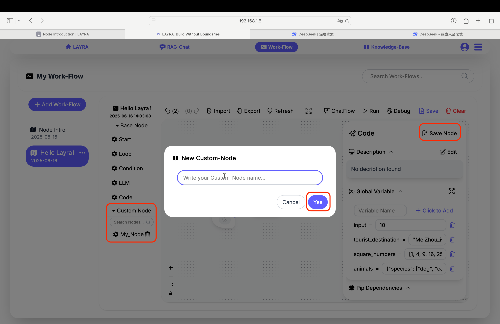
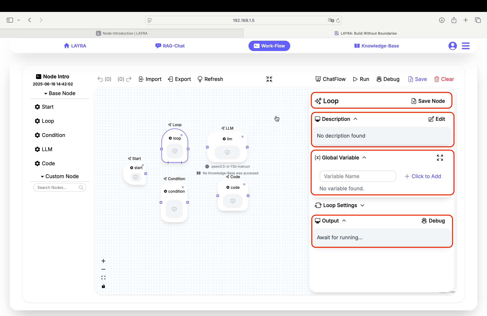
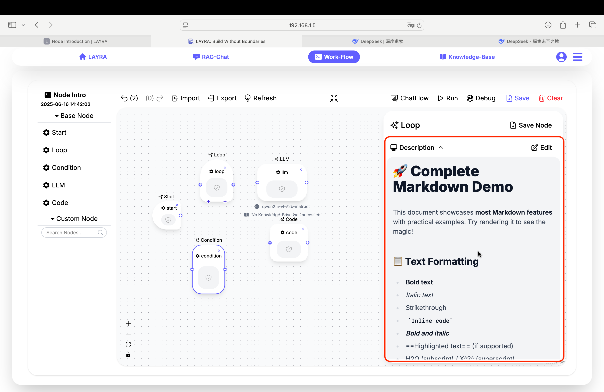
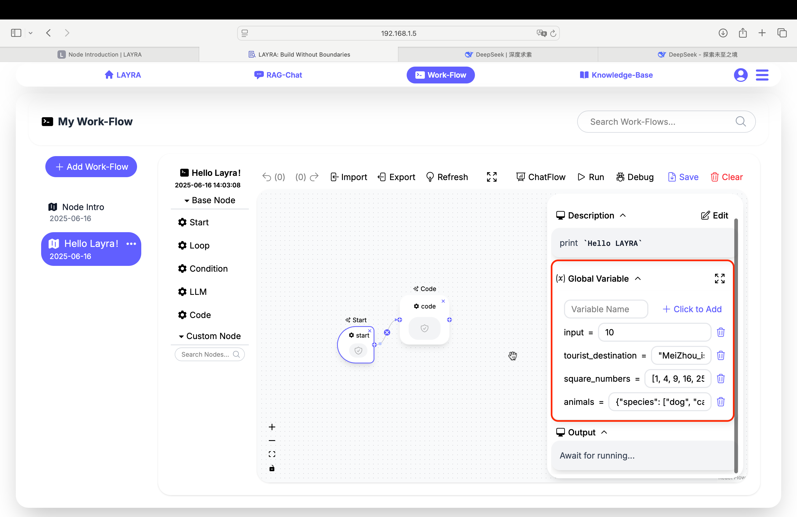
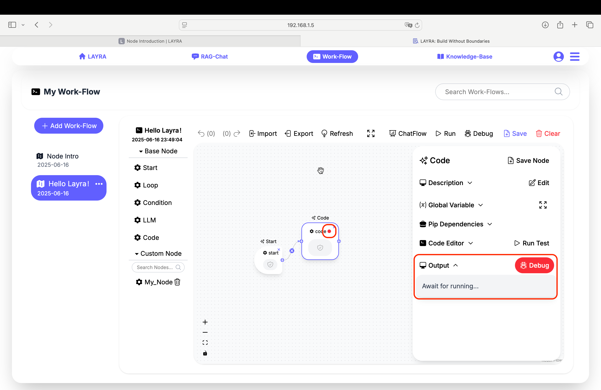

# Node Introduction

Nodes are the core components of workflows. Before starting this chapter, ensure you've mastered the previous chapter: **Basic Concepts**.

---

## Node Configuration Interface

When you click on a node, its detailed configuration appears in the right-side panel. At the top of the configuration window:

1. **Node Name** (Top Section)
   - Click the name to enter edit mode
   - Rename nodes during edit mode
2. **Save Node** Button (Top-Right)  
   
   - Saves configured/coded nodes as custom nodes
   - Saved custom nodes appear in the **Custom Node** section on the left canvas

### Common Node Properties

Each of the five node types has multiple configuration properties, among which three are universal. We'll introduce these shared properties first (specific properties will be covered later):

1. **Description**
2. **Global Variable**
3. **Output**

---

## Description

The **Description** field serves as documentation for nodes or workflows (e.g., functionality, inputs/outputs). Key features:

- Click the **Edit** button to enable markdown editing
- Descriptions support full markdown rendering
- The button toggles to **Preview** mode to view rendered results

:::tip BEST PRACTICE
We recommend:

- Use the Start node's description for **workflow overview**
- Use other nodes' descriptions for **node-specific documentation**
:::

---

## Global Variable

Global Variables are shared across all nodes in a workflow and can be modified anywhere. For details, refer to the **Basic Concepts** chapter. The interface includes:

- A **full-screen icon** (right side): Expands **Configuration Interface**
- Particularly useful for code/LLM node development

---

## Output

The **Output** section displays runtime information including:

- Runtime outputs (e.g., `print()` results from Code nodes)
- Execution status
- Error messages

Features:

- All nodes except **Start** have a **Debug** button
- Clicking Debug adds a red dot breakpoint marker to the node
- Breakpoints enable debugging during workflow execution (detailed in later chapters)

---

## Next Steps

Detailed guides for each node type will follow in subsequent chapters.
