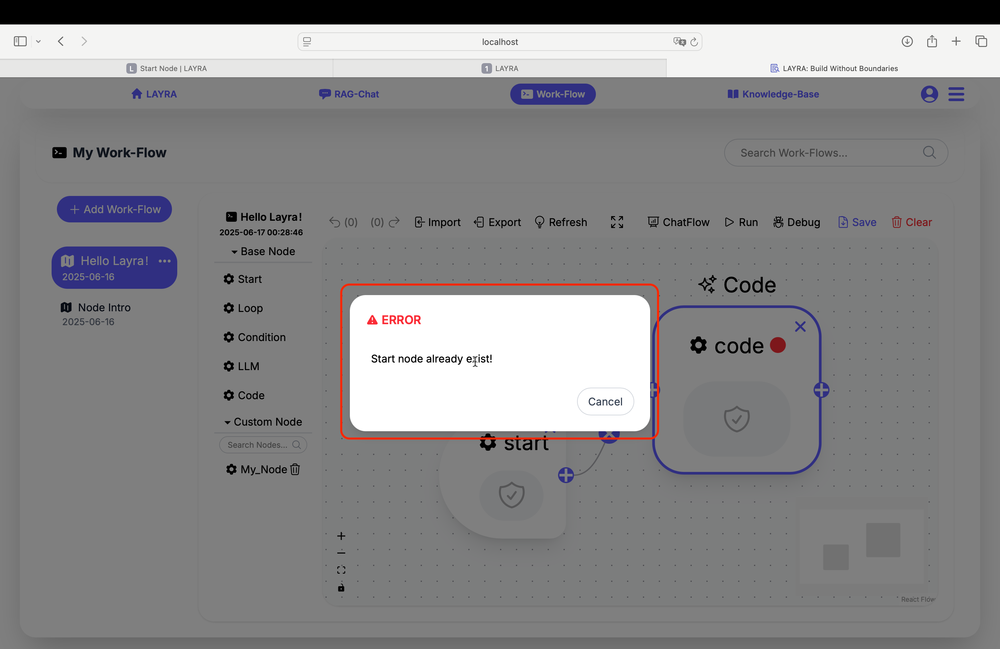

# Start Node
The Start node serves as the entry point for workflow execution. Every workflow must contain exactly one Start node, and adding this node is the first step in building a workflow.

If you attempt to add another Start node after one already exists, the system will display the warning:  
**"Start node already exists!"**

:::tip Why Start Nodes Exist Without End Nodes
**Purpose of the Start node**:  
Workflows require a single, unambiguous entry point to instruct the backend engine where to begin execution.

**Absence of End nodes**:  
The backend engine automatically completes execution after processing all reachable nodes. Eliminating End nodes reduces unnecessary complexity in workflow design.
:::

Clicking the Start node reveals its configuration panel on the right canvas area, including three settings:  
- **Description**  
- **Global Variable**  
- **Output**  

These configurations have been discussed in the **[Node Introduction](./node-intro)** chapter and will not be repeated here.

---

## Next Steps
Now that you understand the Start node, dive into exploring other functional nodes!