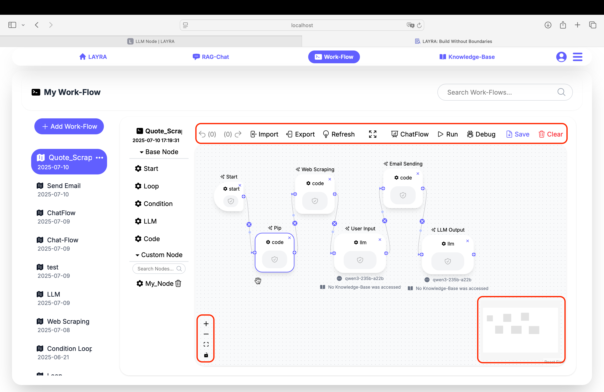
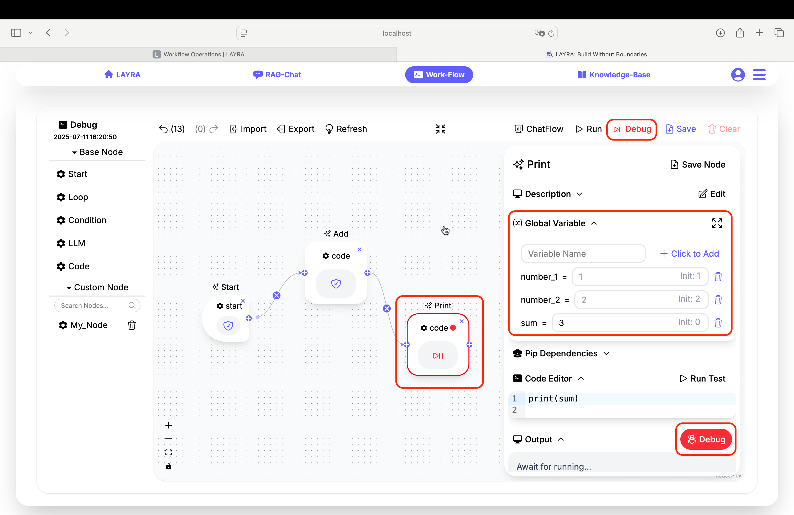

# Workflow Operations

This final chapter covers fundamental workflow operations and critical usage considerations.

---

## Core Operations

The workflow canvas features essential controls organized into distinct functional areas:

### Top Toolbar Functions

Left to right:

1.  **Undo**: Reverts the last canvas action
2.  **Redo**: Restores the last undone operation
3.  **Import**: Loads workflows from external `.json` files
4.  **Export**: Saves current workflow to `.json` format  
    ⚠️ _Excludes sensitive credentials (e.g., LLM API keys)_
5.  **Refresh**: Reloads canvas  
    ⚡ _resets workflow to pre-execution state without interrupting execution_
6.  **Fullscreen**: Toggles full-screen display
7.  **Chatflow**: Shows/Hides the Chatflow panel
8.  **Run**: Executes the current workflow
9.  **Debug**: Runs workflow in debug mode
10. **Save**: Persists workflow modifications to storage
11. **Clear**: Resets canvas (removes all nodes)  
    ⏹️ _During execution, this becomes a **Stop** button to terminate workflow after current node completion._

:::caution IMPORTANT
• Undo/Redo history clears upon page refresh or navigation  
• While auto-save functions periodically, manual saving is recommended  
• Nodes default to 1-hour timeout  
• **Stop** only interrupts after current node completion  
• Always test workflows before execution to prevent infinite loops
:::

### Canvas Navigation Controls

**Bottom-left:**

- **Zoom In**: Enlarges view (+)
- **Zoom Out**: Reduces view (-)
- **Reset View**: Restores default zoom + centers workflow
- **Lock Toggle**:  
  🔓 _Unlocked_: Enables individual node movement  
  🔒 _Locked_: Moves entire workflow during drag

**Bottom-right:**

- **Minimap**: Workflow overview with viewport indicator

---

## Debug Mode

Debug mode functions similarly to code compilers. You can temporarily pause workflow execution using breakpoints to inspect variable values and compare them against initial states.

### Key Features:

1. **Breakpoint Setup**
   - Available on all nodes except Start node
   - Click `Debug` button in node config's **Output** section
   - Active breakpoints show 🔴 icon next to node name

### Debug Walkthrough

Consider a workflow with two Code nodes managing three variables:  
`number_1`, `number_2`, and `sum`

**Node 1**: Executes `sum = number_1 + number_2`  
**Node 2**: Prints `sum` value

**Debug Process**:

1. Set breakpoint on Node 2
2. Run debug mode
3. Observe **Global Variables**:
   - Current values: `number_1=1`, `number_2=2`, `sum=3`
   - Initial values: `1`, `2`, `0`
4. Continue execution → Node 2 prints `3`
5. _Advanced_: Force-change `sum` to `4` during debug → Final output becomes `4`

---

## Next Steps

You've now mastered LAYRA workflow fundamentals! Proceed to:

1. Explore official templates in [Template Gallery](./template-gallery.md)
2. Design custom workflows for your specific needs
3. Discover advanced features beyond this tutorial

**Build without boundaries** - Your LAYRA journey starts now!

:::tip SUPPORT CHANNELS
- *China users*: Scan QR code below to join WeChat support group  
- *Global users*: Contact author directly at liweixmu@foxmail.com  
:::

> **"Thank you for choosing LAYRA to accelerate your AI application development. We applaud your commitment to exploring cutting-edge AI technology and wish you every success in your work."**  
> _Wei Li, Founder, LAYRA Project_
